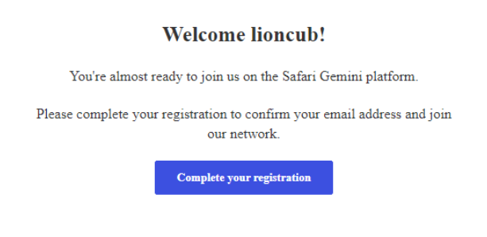

# Safari Gemini User Guide

Unlock efficiency, enhance communication,and drive growth with our comprehensive platform designed for tour operators and stakeholders.

## Tour Operations

To access Safari Gemini landing page, use the [safarigemini.com](https://safarigemini.com)

### Account Creation and Login Process

#### Sign Up/ Account Creation

On the landing page, locate and click on the "Sign Up" button which is at the Navbar section of the page. This will redirect you to the registration page.

On the registration page form insert all the required details

* `Username`

* `Email Address`

* `Password` Create a strong password (follow any password guidelines provided on the form)

* Click on the checkbox Accepting the [Terms of Service](https://safarigemini.com/public/tos) and [Privacy Policy](https://safarigemini.com/public/privacy-policy)

Failure to insert the details correctly the system will highlight the errors at the page with a red notification on the area with an issue which you'll be prompted to insert correctly for you to be able to go forward with the registration.

##### Email Verification
Once you have entered your personal information, you will receive a verification email on the provided email address during registration. Click on the verification link to verify your account.

Then the link will take you back to your account set-up menu and click on the Already Verified icon. If you didn't get an verification email you can click on the resend verfifcation email button for the system to resend the mail.

##### Add User's Information

Fill out the registration form with your personal details. This typically includes:

* Full Name: Enter your first and last name.

* Email Address: Provide a valid email address.

* Phone Number: Enter your contact number for verification and communication purposes.

##### Company Registration

1. Set up the admins personal settings by filling all slots

2. Save the profile and continue

` NB: ` The details are to be filled in only once so the information needs to be <b>CORRECT</b> and <b>FACTUAL</b> for one willn't be able to modify the 
information later once filled unless they contact [support@moorskhandi.io](mailto:support@moorskhandi.io)

Fill in your company physical address and other required credentials

Select country, organization's name, your companies registration number, business type then save and continue 

After filling up the details you'll get up a Congratulations Pop-up indicating the details have been filled in the right format and saved correctly.

#### Sign In/Login

With already a registered User account you will click on the Login button on the navbar from the landing page and the system will direct you to enter your 
login credentials

* Username/Email Address

* Password

### Dashboard

After a successful Sign Up or Login, the system will redirect you to the dashboard. The dashboard serves as the central hub for managing all aspects of your operations, from trips and clients to payments and exports.

### Admin Panel
The Admin Panel in Safari Gemini is a robust feature that allows administrators to manage various aspects of the platform. It provides tools to control company details, manage users and partners, oversee drivers, manage client sources, and handle forex operations.

#### Company details
The Company Details section allows you to manage and update the fundamental information about your organization.
Ensure all company information is accurate and up-to-date.

* Company Name: Update the official name of your company.
* Address: Add or edit the company's physical address.
* Contact Information: Manage the primary contact details, including phone numbers and email addresses.
* Logo: Upload or update your company logo for branding purposes.

#### Users
The Users section is where you manage all the users within your organization. This includes adding new users, assigning roles, and managing permissions.
Assigning roles to users is essential for enabling access to other tools and features within the platform after the first login.

User Roles:- Assign different roles with specific permissions

1. ACCOUNTANT
2. DRIVER
3. TRIP MANAGER
4. CUSTOMER CARE
5. TRANSLATOR
6. GUIDE
7. ADMIN 

* User Management: Add, edit, or remove users from the platform.
* Access Control: Define and manage what each role can access and modify within the platform.
* Manage Permissions: Regularly review and update user roles and permissions to ensure proper access control.

#### Partners
The Partners section allows you to manage relationships with external partners, such as travel agencies, vendors, and service providers.

* Add Partners: Add new partners to the system with all relevant details on the (+) icon from the forms navbar section.
* Update Information: Keep partner profiles up-to-date with the latest information.
* Review Contracts: Ensure all partner agreements are current and accurately reflected in the system.

#### Drivers
The Drivers section is dedicated to managing all the drivers associated with your organization, ensuring efficient and reliable transportation for clients.

* Driver Profiles: Maintain detailed profiles for each driver, including contact information, licenses, and experience.
* Assignment Tracking: Track which drivers are assigned to which trips.
* Performance Metrics: Evaluate driver performance based on feedback and trip outcomes.

#### Client source
The Client Source section helps you track and manage the origins of your clients, which is crucial for marketing and business development.

* Source Tracking: Identify and categorize where clients come from (e.g., referrals, partner agencies).
* Analysis Tools: Analyze client source data to understand which channels are most effective.

#### Forex
The Forex section allows you to manage foreign exchange operations, crucial for handling international clients and transactions.

* Exchange Rates: Monitor and update current exchange rates.
* Transaction Management: Handle forex transactions efficiently.

### Trips
The Trips section is where you manage all your trip-related activities. 
It is divided into several categories to help you organize and track the status of each trip efficiently.

##### PROSPECTIVE TRIPS
Prospective Trips are trips that are in the initial stages of planning. These are potential bookings where clients have shown interest but have not yet confirmed.

* Review client inquiries and initial details.

* Communicate with clients to gather more information and provide preliminary itineraries.

##### FORM RECEIVED / ITINERARY SENT
This category includes trips for which the initial forms have been received, and an itinerary has been sent to the client.

* Ensure all required information is collected from clients.
* Prepare and send detailed itineraries.
* Follow up with clients to answer any questions and confirm details.

##### IN COMMUNICATION
Trips that are in the discussion phase with clients, where details are being negotiated and finalized.

* Address any concerns or requests from clients.
* Finalize the trip details and prepare for confirmation.

##### CONFIRMED
Trips that have been confirmed by clients and are set to proceed as planned.

* Coordinate with service providers such as drivers and tour guides.
* Ensure all bookings (flights, hotels, activities) are confirmed.
* Prepare necessary documents like visas, kits, and flight tickets.

##### CANCELLED
Trips that have been cancelled by the client or the operator.

* Manage any cancellations and process refunds if applicable.
* Update records and notify relevant stakeholders of the cancellation.

##### GHOSTED
Trips where the client has stopped responding or communicating.

* Attempt to re-establish contact with the client.
* Keep records updated and consider the trip as inactive if no response is received.

### Calendar
The Calendar section provides a visual representation of all scheduled trips and activities. It allows you to manage and view upcoming trips and important dates efficiently.

### Clients

* Client Profiles: Create and manage detailed profiles.
* Communication Logs: Track all communications with clients.
* Feedback and Reviews: Collect and analyze feedback.

### Customer Payments
The Customer Payments section helps you manage payments made by clients.

* Payment Tracking: Track all payments received from clients.
* Payment Methods: Support for multiple payment methods.
* Payment History: View the history of all transactions.

### Payment Schedule
The Payment Schedule section allows you to plan and manage payment schedules for your clients.

* Scheduled Payments: View and manage upcoming scheduled payments.
* Due Dates: Track payment due dates to ensure timely payments.
* Payment Reminders: Send reminders to clients about upcoming payments.

### Export
The Export section provides tools to generate important documents for your clients with a download option.
Below is a downloaded receipt from the system in pdf format

#### Invoice
Generate detailed invoices for the services provided to your clients.

#### Receipt
Create and issue receipts for payments received.

#### Reservation Voucher
Produce reservation vouchers for confirmed bookings, including all relevant details for the client.

### Account Settings

The Account Settings section in the Safari Gemini platform allows users to manage their personal and organizational information, ensuring that their account details are up-to-date and their preferences are correctly configured.

* Update Personal Details: Regularly review and update your personal information to ensure it is current.
